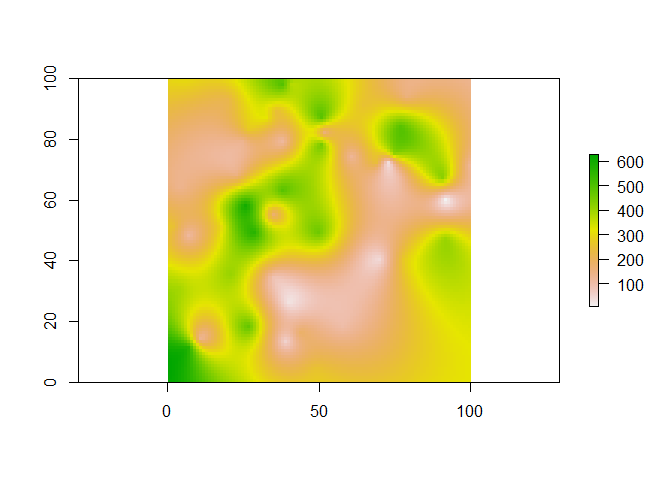
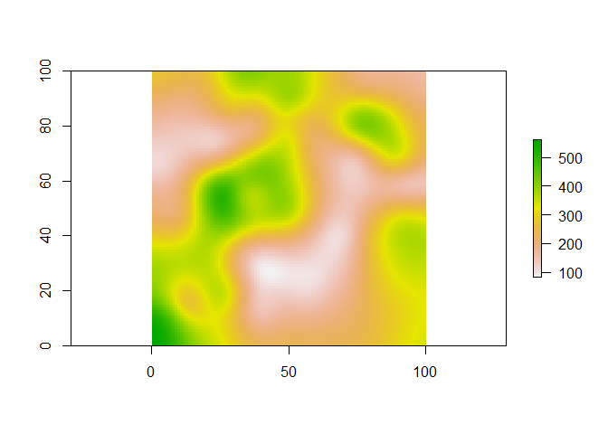
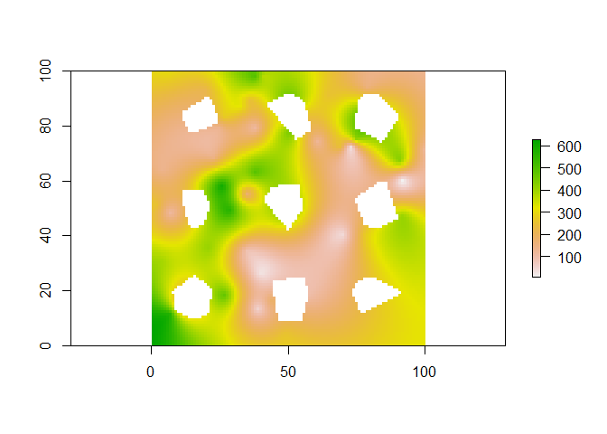
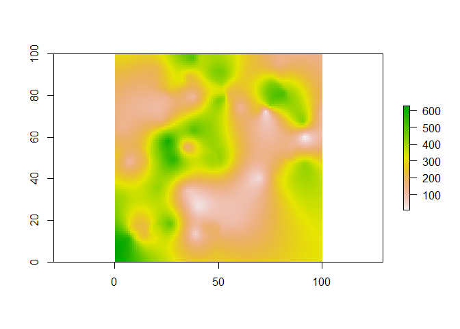
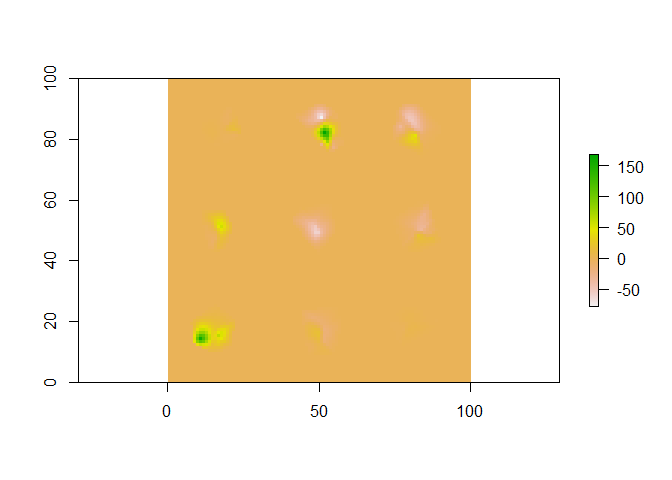

<!-- README.md is generated from README.Rmd. Please edit that file -->
rdemtools
=========

The goal of *rdemtools* is to provides functions to edit digital elevation models (**DEMs**). This package is very simple, with only a few functions and without new classes. However, it offers an easy way to use the power of R to edit DEMs.

Installation
------------

You can install rdemtools from github with:

``` r
# install.packages("devtools")
devtools::install_github("GastonMauroDiaz/rdemtools")
```

Example
-------

This is a basic example which shows you how to solve a common problem:

``` r
set.seed(11)
reference <- fake_dem(n_random_data = 60, z_range = c(0, 600))
#> [using ordinary kriging]
plot(reference)
```



``` r

set.seed(18)
fillSource <- fake_dem(z_range = c(0, 20))
#> [using ordinary kriging]
fillSource <- fillSource - mean(fillSource[])
fillSource <- fillSource + reference
fillSource <- smooth_dem(fillSource, theta = 6)
plot(fillSource)
```



``` r

p <- sampleRegular(reference, 10, sp = TRUE)
voidsMask <- fake_voids(p, void_size = 20, reference)

dem <- reference
dem[voidsMask] <- NA
plot(dem)
```



``` r

slp <- terrain(fillSource, "slope")
asp <- terrain(fillSource, "aspect")
demF2 <- fill_voids_k08(dem, slp, asp, show_progress_bar = FALSE)

plot(demF2)
```



``` r

plot(demF2 - reference)
```



Vignette
--------

After install *rdemtools*, you can see the vignettes with:

``` r
browseVignettes(package = "rdemtools")
```
